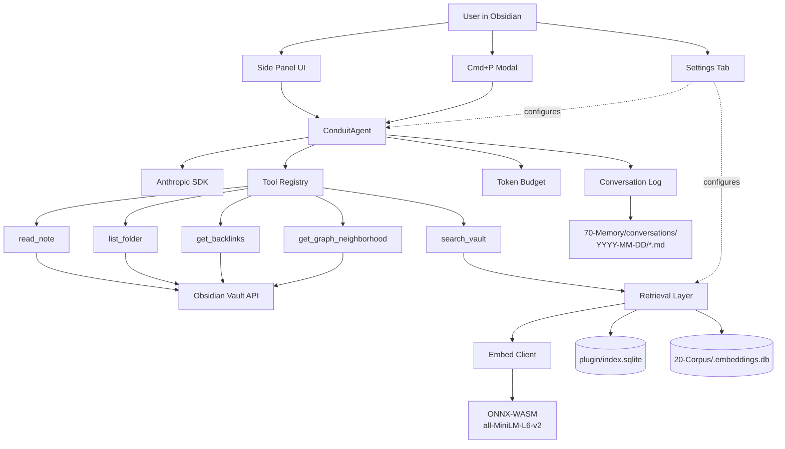

# Sagittarius v0.1 — Spec

> **Phase 1 deliverable** per [[20-Decisions/2026-05-04-sagittarius-build-process|ADR-010]] §6. Architecture diagram, data model, tool list with TypeScript signatures, UI wireframes, threat model.
>
> **Scope:** v0.1 is the read layer per killer prompt §3.1 — chat-in-vault, retrieval-grounded, no writes. Successor specs (`v0.5_spec.md`, `v1.0_spec.md`) cover later phases.
>
> **Reviewer:** Thad. Sign-off required before Phase 2 (scaffold) begins.

---

## 1. v0.1 in one paragraph

Sagittarius v0.1 is **Hangar in your Obsidian sidebar.** A side panel + modal where the user types a question, Claude answers using vault context retrieved via the canonical local embedding service ([[Assets/code/corpus-ingest/parsers/embed_interface|per the embedding contract]]), and every answer cites the notes it consulted. No writes to the vault. No transaction log. No curator. Just retrieval-grounded chat with the Hangar voice, native to Obsidian.

**Success criterion** (per [[20-Decisions/2026-05-04-sagittarius-build-commitment|ADR-009 Q3]]):

1. *"Where does Phase 1 stand?"* → Hangar-voice answer citing `[[50-FortressFlow/Pipeline_State]]`.
2. *"Pull up everything on Soltura"* → ranked notes across `41-Soltura/`, `40-Quantum-Distillery/`, anchor hypothesis.
3. Verifiable retrieval via `schema_meta.writer == 'sagittarius'` in the SQLite index.

---

## 2. Architecture (mermaid)



### Component responsibilities

| Component | Responsibility |
|---|---|
| **Side Panel UI** | Persistent chat surface in Obsidian's right sidebar. Stream tokens, render markdown, show retrieval citations, "Why?" button per killer prompt §5. |
| **Cmd+P Modal** | Quick-question entry — single-shot Q&A without opening the side panel. |
| **Settings Tab** | API key field, model selection (Sonnet 4.6 default, Opus 4.7 fallback), indexing controls (build / rebuild), token budget caps. |
| **ConduitAgent** | Orchestrates the chat loop. Manages context, tool-use, retries, model fallback, budget enforcement. |
| **Tool Registry** | Owns the v0.1 tool surface (5 read tools below). Each tool has input schema + handler + tests. |
| **Retrieval Layer** | Implements `queryUnified` from the embedding contract. Reads BOTH the plugin's own index.sqlite AND `20-Corpus/.embeddings.db`. |
| **Embed Client** | Encodes query strings via ONNX-WASM (`all-MiniLM-L6-v2`). Same model as corpus-ingest. |
| **Token Budget** | Per-day token + dollar caps. Hard-stop when exceeded. Persisted to plugin data dir. |
| **Conversation Log** | Every chat session writes a markdown file to `70-Memory/conversations/YYYY-MM-DD/{session-id}.md`. First-class vault object per killer prompt §3.1. |

---

## 3. Data model

### 3.1 Settings (per-vault, in plugin data dir)

```typescript
interface SagittariusSettings {
  // Anthropic API
  apiKey: string;                            // never persisted to git; stored in plugin data dir only
  defaultModel: 'claude-sonnet-4-6' | 'claude-opus-4-7' | 'claude-haiku-4-5-20251001';
  fallbackModel: 'claude-sonnet-4-6';        // when Opus times out

  // Retrieval
  indexingMode: 'auto' | 'manual';           // auto = on-startup + on-edit; manual = user clicks "Index"
  retrievalK: number;                        // top-K chunks per query, default 8
  embeddingProvider: 'local' | 'voyage';     // v0.1: local only; voyage stub in v0.2
  voyageApiKey: string;                      // unused in v0.1
  voyageModel: 'voyage-3' | 'voyage-3-lite'; // unused in v0.1

  // Budget
  maxTokensPerDay: number;                   // default 200000
  maxDollarsPerDay: number;                  // default 10
  budgetResetTimezone: string;               // default "America/Los_Angeles"

  // Conversation log
  conversationLogPath: string;               // default "70-Memory/conversations"
  conversationLogEnabled: boolean;           // default true

  // UI
  sidebarPosition: 'right' | 'left';         // default right
  streamingEnabled: boolean;                 // default true
  showCitations: boolean;                    // default true; when false, hides per-message cite expansion
}
```

### 3.2 Index state — SQLite (per [[Assets/code/corpus-ingest/parsers/embed_interface|embedding contract]] §3)

Plugin DB at `.obsidian/plugins/obsidian-claude-conduit/index.sqlite`. Schema is **identical** to corpus-ingest's; both consumers honor `schema_meta.schema_version == '1'` and `model == 'sentence-transformers/all-MiniLM-L6-v2'`.

The plugin DB indexes the **whole vault EXCEPT `20-Corpus/`** (corpus-ingest owns that namespace).

### 3.3 Conversation log (markdown, per session)

Path: `70-Memory/conversations/YYYY-MM-DD/{session-id}.md`. Frontmatter:

```yaml
---
type: conversation
session_id: <uuid>
started: YYYY-MM-DDTHH:MM:SSZ
ended: YYYY-MM-DDTHH:MM:SSZ
model: claude-sonnet-4-6
total_tokens: 12345
total_cost_usd: 0.04
turn_count: 7
notes_referenced: [[Note A], [[Note B], ...]
tools_used: [search_vault, read_note]
---
```

Body: alternating `## User` and `## Sagittarius` H2 sections with markdown content + retrieval blocks. Indexable by Dataview, searchable like any other note. Per killer prompt §3.1 — conversations are first-class vault objects.

### 3.4 Token budget (in-memory + persisted JSON)

`.obsidian/plugins/obsidian-claude-conduit/budget.json`:

```json
{
  "day": "2026-05-04",
  "tokens_input": 0,
  "tokens_output": 0,
  "dollars_estimated": 0.0,
  "tz": "America/Los_Angeles"
}
```

Reset daily at midnight in the configured timezone.

---

## 4. Tool surface (v0.1 = 5 read tools)

Every tool follows the Anthropic tool-use schema. Definitions:

### 4.1 `read_note`

```typescript
{
  name: "read_note",
  description: "Read a vault note's frontmatter and body. Returns null if path doesn't exist or is outside the vault.",
  input_schema: {
    type: "object",
    properties: {
      path: {
        type: "string",
        description: "Vault-relative path with forward slashes, e.g. '50-FortressFlow/Pipeline_State.md'"
      }
    },
    required: ["path"]
  }
}

// Output:
type ReadNoteResult = {
  path: string;
  frontmatter: Record<string, unknown> | null;
  body: string;          // body after frontmatter strip
  mtime: number;          // POSIX epoch seconds (float)
  size_bytes: number;
} | null;
```

### 4.2 `list_folder`

```typescript
{
  name: "list_folder",
  description: "List the markdown notes in a vault folder. Optional recursive.",
  input_schema: {
    type: "object",
    properties: {
      path: { type: "string", description: "Vault-relative folder path" },
      recursive: { type: "boolean", default: false }
    },
    required: ["path"]
  }
}

// Output:
type ListFolderResult = {
  folder: string;
  notes: Array<{ path: string; size_bytes: number; mtime: number }>;
  subfolders: string[];
};
```

### 4.3 `search_vault`

```typescript
{
  name: "search_vault",
  description: "Semantic + lexical search across the vault. Returns top-K matched chunks with scores and citations.",
  input_schema: {
    type: "object",
    properties: {
      query: { type: "string" },
      limit: { type: "integer", default: 8, maximum: 100 },
      source_db: {
        type: "string",
        enum: ["self", "corpus", "both"],
        default: "both",
        description: "self=plugin's own vault index; corpus=20-Corpus index; both=unified"
      },
      filter_path_prefix: {
        type: "string",
        description: "Optional. Restrict to notes under this folder, e.g. '40-Quantum-Distillery/'"
      }
    },
    required: ["query"]
  }
}

// Output: list of QueryResult per embedding contract §5, with source_db tag.
```

### 4.4 `get_backlinks`

```typescript
{
  name: "get_backlinks",
  description: "Get all notes that link to the given note via wikilinks.",
  input_schema: {
    type: "object",
    properties: {
      path: { type: "string" }
    },
    required: ["path"]
  }
}

// Output:
type BacklinksResult = {
  target: string;
  inbound: Array<{ path: string; line_numbers: number[] }>;
  total: number;
};
```

### 4.5 `get_graph_neighborhood`

```typescript
{
  name: "get_graph_neighborhood",
  description: "Get the wikilink graph N hops out from a note. Useful for 'pull up everything on X' queries.",
  input_schema: {
    type: "object",
    properties: {
      path: { type: "string" },
      depth: { type: "integer", default: 1, maximum: 3 }
    },
    required: ["path"]
  }
}

// Output:
type NeighborhoodResult = {
  origin: string;
  nodes: Array<{ path: string; depth: number; title: string | null }>;
  edges: Array<{ from: string; to: string; type: 'wikilink' | 'related' | 'anti_link' }>;
};
```

### Out of scope for v0.1

These tools belong in later phases:
- `create_note`, `patch_note`, `append_to_note`, `move_note`, `rename_note`, `link_notes`, `add_frontmatter`, `rewrite_section`, `file_asset` → **Phase 4 (write layer)**
- `get_curator_proposals`, `apply_curator_suggestion`, `dismiss_curator_suggestion` → **Phase 7**
- `propose_note` (cited generative draft) → **Phase 8**
- `get_dossier`, `update_memory` → **Phase 9**

The Tool Registry is designed to grow — adding tools in later phases is a single-file change per tool.

---

## 5. UI wireframes (ASCII)

### 5.1 Side panel — chat mode (default)

```
┌─ Sagittarius ─────────── ⚙  ⟳ ─┐
│                                 │
│ [Chat] [Vault QA] [History]     │  ← tabs
│                                 │
│ ┌─────────────────────────────┐ │
│ │ User                        │ │
│ │ Where does Phase 1 stand?   │ │
│ └─────────────────────────────┘ │
│                                 │
│ ┌─────────────────────────────┐ │
│ │ Sagittarius                 │ │
│ │ 14/16 SENT as of last       │ │
│ │ sweep ([[Pipeline_State]]). │ │
│ │ Drift: file last touched 6  │ │
│ │ days ago.                   │ │
│ │ ▾ Why? (3 notes consulted)  │ │
│ └─────────────────────────────┘ │
│                                 │
│ ╭─────────────────────────────╮ │
│ │ Type a message…  ↵ to send  │ │
│ ╰─────────────────────────────╯ │
│                                 │
│  Tokens: 12.4K / 200K daily  $  │  ← budget bar
└─────────────────────────────────┘
```

### 5.2 Side panel — Vault QA mode

Same as chat, but the system prompt forces retrieval-first behavior: every answer must cite at least one note from `search_vault` results.

### 5.3 Side panel — "Why?" expanded

```
│ ▾ Why? (3 notes consulted)      │
│                                 │
│ 1. [[50-FortressFlow/           │
│    Pipeline_State]] (0.91)      │
│    "Status: 14 of 16 live       │
│    contacts SENT, 2 REPLIED..." │
│                                 │
│ 2. [[50-FortressFlow/           │
│    Sweep_Log]] (0.78)           │
│    "2026-04-16: no new replies  │
│    or bounces; 6 primaries..."  │
│                                 │
│ 3. [[CLAUDE]] (0.62)            │
│    "FortressFlow Phase 1 —      │
│    LIVE; 6 primaries + 9..."    │
│                                 │
│ Model: claude-sonnet-4-6        │
│ Steps: 2 | Tools: search_vault, │
│   read_note                     │
│ Tokens in/out: 8.2K / 1.4K      │
└─────────────────────────────────┘
```

### 5.4 Cmd+P modal (single-shot Q&A)

```
┌──────────────────────────────────────────┐
│ Sagittarius — quick question             │
│ ┌──────────────────────────────────────┐ │
│ │ Who's Wallace and what's the last    │ │
│ │ touch?                               │ │
│ └──────────────────────────────────────┘ │
│                                          │
│  Mode: ○ Chat  ● Vault QA                │
│  ↵ Ask       Esc Cancel                  │
└──────────────────────────────────────────┘
```

### 5.5 Settings tab

```
┌─ Sagittarius ────────────────────────────┐
│                                          │
│ ▸ API                                    │
│   Anthropic API Key: ●●●●●●●●●●●●●  Edit │
│   Default model: [claude-sonnet-4-6  ▾] │
│   Fallback model: [claude-opus-4-7   ▾] │
│                                          │
│ ▸ Retrieval                              │
│   Indexing: ○ Manual  ● Auto on save     │
│   Top-K chunks: [ 8  ]                   │
│   ⟲ Build Index   (last: 2 min ago)      │
│   ⟳ Rebuild from scratch                 │
│                                          │
│ ▸ Budget                                 │
│   Max tokens/day: [ 200000  ]            │
│   Max dollars/day: [ 10.00  ]            │
│   Today: 12.4K tokens / $0.32            │
│   Reset timezone: [America/Los_Angeles ▾]│
│                                          │
│ ▸ Conversation log                       │
│   ☑ Save conversations to vault          │
│   Path: [70-Memory/conversations]        │
│                                          │
│ ▸ Voyage (opt-in, v0.2)                  │
│   ☐ Enable Voyage retrieval              │
│   API key: [—]  (disabled in v0.1)       │
│                                          │
└──────────────────────────────────────────┘
```

---

## 6. Agent loop semantics

### 6.1 Per-turn flow

1. User sends message in side panel (or modal).
2. Plugin loads conversation history from in-memory state + last N turns from `70-Memory/conversations/today/{session}.md`.
3. **System prompt** built from:
   - [[THAD_MAN]] constitution
   - [[21-Agents/concierge|Hangar skill spec]] (voice rules)
   - Mode-specific addendum (Chat vs Vault QA)
   - Available tools list
4. ConduitAgent runs `client.messages.create({ tools, messages, system })`.
5. If response has `stop_reason: "tool_use"` → execute tool calls, append results to messages, loop.
6. If response has `stop_reason: "end_turn"` → stream final answer to side panel, persist conversation log, update budget.
7. Hard cap at 20 tool-use steps per turn. If exceeded → user-facing error + log.

### 6.2 System prompt construction (cached)

Per killer prompt §4 — leverage prompt caching. The constitution + skill spec + tools list rarely change; cache breakpoint is set after them. Variable per-turn content (retrieved chunks, conversation history) sits below the cache breakpoint.

### 6.3 Budget enforcement

- Pre-flight check: if `tokens_used_today > maxTokensPerDay - 4096` (4096 = max output reserve), refuse with user-facing error. Same for dollars.
- Post-flight: increment `tokens_input` + `tokens_output` from response usage. Estimate cost using the model's pricing.

### 6.4 Model fallback

- Default: Sonnet 4.6.
- If Sonnet returns 503 / overloaded → retry once with Opus 4.7.
- If both fail → user-facing error, no silent degradation.

---

## 7. Threat model

| Threat | Vector | Impact | Mitigation |
|---|---|---|---|
| **API key leak via git** | User pastes key, plugin writes to `data.json`, vault auto-commit pushes to remote | Anthropic API impersonation, billing | Plugin data dir gitignored by default. Plugin checks at startup; warns if `data.json` not in `.gitignore`. Per [[90-Antimemory/Failed-Paths/2026-05-04-leaked-rest-api-credential|antimemory inoculation rule]]. |
| **Vault content sent to Anthropic** | Every chat sends retrieved chunks to API | Data leak if vault contains sensitive content | All API calls require explicit `apiKey` setting (opt-in). Conversation log captures what was sent. Future v0.2: secrets-scrubber regex pass before send. |
| **Path traversal** | User or LLM provides `../../../etc/passwd` to a tool | Filesystem read outside vault | Every tool validates: `realpath(input).startsWith(vault_root)`. Error if not. |
| **SQL injection in retrieval** | LLM-generated query strings reach SQLite | DB corruption, data exfil | Parameterized queries only. No string interpolation in SQL. |
| **Cost runaway** | Bug or adversarial input triggers infinite tool-use loop | API bill spike | Hard caps: 20 tool-use steps per turn, daily token + dollar ceilings. |
| **Embedding cache poisoning** | Attacker injects malicious chunk text into the vault | Skewed retrieval | Embeddings are computed from vault files only; vault is the trust boundary. If vault is compromised, the user has bigger problems. |
| **Self-signed cert MITM** | Local REST API plugin coexistence — but Sagittarius doesn't use it | N/A for Sagittarius | Out of scope; mentioned for context. |
| **Unsanitized markdown render** | Retrieved chunk has malicious HTML | XSS in side panel | Render via Obsidian's standard markdown renderer — sanitization is Obsidian's contract. Don't bypass with `innerHTML`. |
| **Conversation log contains secrets** | User pasted an API key into chat | Secret in vault | v0.2: secrets-scrubber redacts before write. v0.1: user is responsible (documented in README). |
| **Plugin update auto-pulls malicious version** | Compromised release in registry | Code execution | Pin to specific version in BRAT. Sign releases starting v1.0. |

### Threats explicitly NOT mitigated in v0.1

- **Anthropic API itself going down.** No fallback to local LLM. Documented in README.
- **Vault corruption from a bug.** v0.1 has no writes; bugs at most cause bad retrieval, never bad writes. Phase 4 (write layer) introduces this threat and will be paired with the transaction log + undo per killer prompt §3.2.
- **Multi-vault data leak.** Per ADR-007 Q3, multi-vault from day 1 means each vault has its own plugin data dir + index. No cross-vault data flow by design.

---

## 8. v0.1 acceptance gates

A PR is "ready for v0.1 merge" only when **all** of these are green:

- [ ] Builds with `npm run build` — single `main.js` bundle, no errors.
- [ ] Loads in Obsidian (manual test by Thad on the live vault).
- [ ] Side panel renders, accepts input, streams response.
- [ ] All 5 tools execute against real vault content; integration tests pass.
- [ ] Search returns reasonable results for the 3 success-criterion queries.
- [ ] `schema_meta.writer == 'sagittarius'` written on first index.
- [ ] Budget ceilings actually stop a runaway loop.
- [ ] Conversation log lands at `70-Memory/conversations/YYYY-MM-DD/{session}.md` with the documented frontmatter.
- [ ] No `any` types except FFI boundaries (per killer prompt §9).
- [ ] Vitest suite green; integration tests against fixture vault green.
- [ ] README documents installation (BRAT) + setup (paste API key) + the 3 success-criterion queries as smoke tests.
- [ ] No telemetry calls. No data leaves the machine without `apiKey` being set.
- [ ] Plugin data dir is gitignored by default (verified by post-install check).

---

## 9. Out-of-scope for v0.1 (explicit)

- Writes of any kind (Phase 4)
- Curator passes / proactive suggestions (Phase 7)
- Generative contributions / cited drafts (Phase 8)
- Voyage embeddings (Phase 3 stub, Phase 4+ enabled)
- MCP bridge (Phase 6)
- Mobile (v1.1+)
- Multi-vault config UI (multi-vault aware code is in v0.1 per ADR-007 Q3, but the UI for managing multiple vaults' settings is v0.5+)
- Activity stream / alerts / digest (Phase 6)
- Memory layer / dossiers (Phase 9)

---

## 10. Open questions for Phase 2 (scaffold)

These don't block Phase 1 sign-off but should be answered before Phase 2 starts:

- **Q1 — ONNX runtime:** `onnxruntime-web` for in-browser ONNX, or `transformers.js` (Xenova) wrapper? Latter is higher-level but adds dependency.
- **Q2 — SQLite layer:** `sql.js` (WASM) or native `better-sqlite3` (Node-only, faster but desktop-only — already restricted)? `better-sqlite3` is faster but ties us to Node.
- **Q3 — UI framework:** Plain TypeScript + Obsidian DOM helpers, or a thin reactive layer like Svelte? Svelte is nice for chat UIs but adds bundle size.
- **Q4 — Streaming:** Anthropic SDK streaming is straightforward; the question is how to render incrementally in Obsidian's markdown renderer without flicker.

Provisional Curator answers (low confidence):
- Q1: `transformers.js` — model loading is the painful part; let the wrapper handle it.
- Q2: `better-sqlite3` — desktop-only is already in the manifest; speed wins.
- Q3: Plain TypeScript — Svelte's bundle cost outweighs the convenience for a v0.1.
- Q4: Render to a contenteditable pre-block during streaming, then re-render to markdown on final.

These get answered in the Phase 2 kickoff session, not now.

---

## 11. Sign-off

**Thad's review checklist before Phase 2 begins:**

- [ ] §1 v0.1-in-one-paragraph captures intent
- [ ] §2 architecture diagram is the right shape
- [ ] §3 data model fields cover what v0.1 needs
- [ ] §4 tool list is sufficient (no missing tool, no extra)
- [ ] §5 UI wireframes are usable
- [ ] §6 agent loop semantics match the desired UX
- [ ] §7 threat model covers what matters
- [ ] §8 acceptance gates are testable
- [ ] §9 out-of-scope list is intentional, not accidental
- [ ] §10 open questions are real questions

If any section is wrong: comment in the PR, revise, re-review. Don't merge until all 10 boxes are checked.

When checked → merge → start Phase 2.

---

## Related

- [[18-Obsidian-Claude-Plugin/00_BUILDER_PROMPT]] — killer prompt
- [[18-Obsidian-Claude-Plugin/01_KICKOFF]] — kickoff (Q1–Q3 resolved)
- [[18-Obsidian-Claude-Plugin/03_PACKAGE_JSON]] — intended package.json
- [[18-Obsidian-Claude-Plugin/04_MANIFEST_JSON]] — intended Obsidian manifest
- [[18-Obsidian-Claude-Plugin/05_CONDUIT_AGENT_SKETCH]] — ConduitAgent class skeleton
- [[20-Decisions/2026-05-04-sagittarius-q1-q3-signoff]] — ADR-007 (architecture)
- [[20-Decisions/2026-05-04-sagittarius-build-commitment]] — ADR-009 (commitment)
- [[20-Decisions/2026-05-04-sagittarius-build-process]] — ADR-010 (process)
- [[Assets/code/corpus-ingest/parsers/embed_interface]] — embedding contract
- [[21-Agents/concierge]] — Hangar skill (loaded into system prompt)
- [[THAD_MAN]] — constitution
